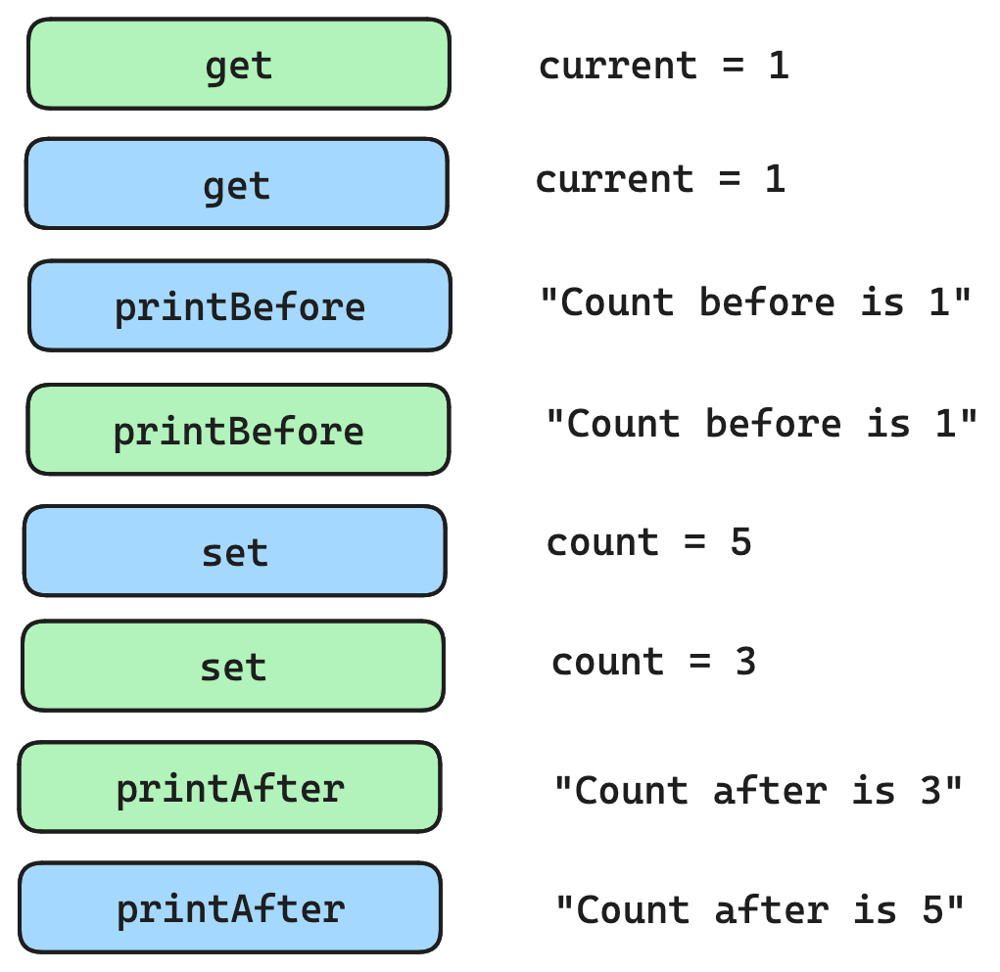
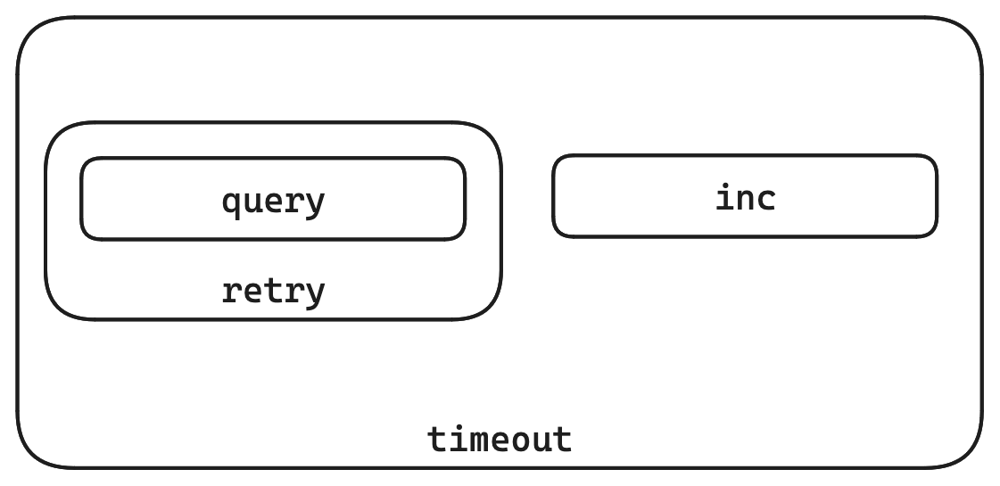

class: center, middle

# The Challenges of Concurrent Systems
## Zainab Ali
### https://zainab-ali.github.io/challenges-of-concurrent-systems

???
---
class: middle

# It's just a demo
 - A webservice
 - One endpoint
 - One user
???
Let's set the scene.

Imagine that you're a junior developer. You work in a small team, in a small company.

It's not doing so well. It doesn't have many customers.

One morning, your manager comes up to you and gives you a task. She says, I need you to design a webservice.

What sort? You ask.

It's a counting service. It just needs one endpoint, to update a counter. And it's only for demo purposes.

It's for our salesperson. He works on Fridays and he's showing off this new system.

That sounds fine. It's just a demo. In fact, it's the perfect task for you because you've never actually written a webservice from scratch before.

You code it quickly and things seem to go well. You get some feedback from the salesperson, and you add a few more features. 

Sometimes it has bugs, but that's ok. Each time you fix them, you take it down. It just needs to be up on Fridays, after all.

And then one day, it sells.

---
class: center, middle

# Sale!
???

Congratulations!, your manager says. We finally have a customer!

Your sales team is having a great day. The whole company seems to be celebrating. 

Except you. You're looking at the contract.

Your service now needs to support thousands of users. It needs to be running all the time, even when you roll out new versions.

So while everyone else is celebrating, you're inside scratching your head wondering how on earth you're going to achieve it.

---
class: center, middle

# Scaling is challenging
???


Scaling a system is hard. It's hard, but not because large scale systems are complex. They're necessarily simple. 

It's hard for you, simply because you haven't done it before. In fact, very few of us have experience scaling systems. And so when we design systems from scratch, we don't design them to be scaled. 

---

class: center, middle
# Concurrency is challenging
## But it doesn't have to be

???

The challenge of scale is the challenge of concurrency.

You don't always need to care about it.

If you're writing an admin script for yourself or your team, you definitely don't need to.

If you're writing a system for ten internal users, you do need to think about concurrency, but not too much.

But for a lot of systems, handling concurrency is vital. If not at the beginning, then at least when they're successful.

Concurrency is challenging, but it doesn't have to be.

I'm Zainab, I'm a functional programmer and trainer, and in particular I train people to build concurrent systems.

I love lots of functional languages, but in particular Scala. Scala is a great language for concurrent systems. 

Does anyone here use it? I'm your community rep. I also organize the London Scala User Group, a local meetup. And I'm a Scala ambassador, which means if you're interested in learning more about Scala, please come ask.

I'm also passionate about open source. I contribute to and maintain concurrency related projects in the Typelevel ecosystem.

That said, you don't need to know anything about Scala or Typelevel, or even want to learn. You're not here to learn how to use this ecosystem, but what makes it's good.

---
class: middle

<div class="side-by-side" style="display: flex;justify-content: space-evenly;">
<div style="display: flex;flex-direction: column;align-items: center;">
<h2>Scala</h2>

</div>
<div style="display: flex;flex-direction: column;align-items: center;">
<h2>Typelevel</h2>

</div>
</div>
???

---
class: middle

# Agenda
 - Reasoning
 - Systems beneath
 - Asynchronous programming
???


---
class: center, middle

# Reasoning

???

Reasoning is concurrency on paper.

---
class: middle

# Calling it once

```sh
/increase?inc=2
``` 

```sh
Count before is 1
Count after is 3
``` 

???

Consider a very simple service. It has a single endpoint that increments a counter.
Here is an example of calling the endpoint.

---
class: middle

# Calling it twice

```sh
/increase?inc=2
/increase?inc=4
```

```sh
Count before is 1
Count before is 1
Count after is 3
Count after is 5
``` 

???

We see the following behaviour when we call the endpoint twice. 

The count is initially one, and we want to increment it by two and four. But at the end, the count is five.

In fact, when we inspect the count later, we see that its value is three!

---
class: middle

```java
public class Service {
    private int count;

    public void increase(int inc) {
        int current = get();
        System.out.println("Count before is " + current);
        int next = current + inc;
        set(next);
        System.out.println("Count after is " + next);
    }

    private int get() {
        return count;
    }

    private void set(int next) {
        count = next;
    }
}
```

???

Here is the code for this service. The increment function gets the count, increments it. It prints out the value before and after.

This is a very simple bug, some of you may have spotted it already. The important thing here is not the bug, but the techniques we use to find it.

---

# Non-determinism


???
There are two basic techniques: identifying shared state, and identifying side-effects.

The source of all concurrency bugs is non-determinism.

By saying these things are concurrent, I mean that they are independent. Unlike a happens before relationship, they happen at the same time.

This non-determinism makes things difficult to reason about. Let's say I have an operation that [example of nondeterminism].

In order to predict what happens, I need to take each of these steps and interleave them in all possible orders, and figure out the result. This can only be done on paper - it's not possible to test for. 

---
class: middle

# Mutable state

```java
private int count;
```

---
class: middle

# Shared mutable state

- Immutable data structures
- Rust makes mutation very hard
- Scala has keywords (`var`, `val`)
- Go: don't share state

---
class: middle

# Side effects

## No side effects

```java
first + second
```

## Side effects

```java
LocalDateTime.now()
```
```java
set(next)
```

---

# Side effects

```java
int current = get();                              // get
System.out.println("Count before is " + current); // printBefore
int next = current + inc;                         // calcNext
set(next);                                        // set
System.out.println("Count after is " + next);     // printAfter
```
---


???

TODO: We could do with a picture here for interleaving the two.

---



???

TODO: Image of side effects and pure code.

---
class: middle

# Tips for reasoning
 - Avoid shared state
 - Identify side effects

---
class: center, middle

# Functional programming

???
---
class: center, middle

# Systems beneath

---
class: middle


---
class: middle


---
class: middle


---

class: middle


---
class: middle


---
class: middle

# Systems beneath

 - Don't use the OS scheduler
 - cats-effect, tokio (Rust), virtual threads all have schedulers

---
class: middle

# Models of concurrency
## Async programming

---
class: middle

# Composition



---
class: middle

# Sequencing

<div>

</div>
---
class: middle

# Sequencing

```scala
for {
 _ <- task
 _ <- task
} yield ()
```
---
class: middle

# Join


```scala
(task, task).parTupled
```

---
class: middle

# Async programming
 - Compose tasks
 - In sequence, concurrently
 - Build bigger tasks
 - Retries, error handling, timeouts
 
---
class: middle
# Retry

```java
private CompletableFuture<int> retry(CompletableFuture<int> fut) {
    return ...
}
```

---

class: middle

# IO

```scala
def retry(task: IO[Int]): IO[Int] = 
  task.handleErrorWith(_ => task)
```

---

# Composition


```scala
(retry(task), inc)
  .parTupled
  .timeout(30.seconds)
```

---
class: center, middle

# Tasks as programs

| Task  | Composable |
|-------|
| Java Future | No |
| Virtual threads | No |
| Scala Future | No |
| cats-effect IO | Yes |
| Rust Future | Yes |

---
class: middle
# Rich ecosystem
---
class: middle
# Recipe
 - Reasoning on paper
  - no shared state
  - identify side effects
  - functional programming
 - Tower of tech
  - Schedulers
 - Composable model
  - Rich ecosystem
  - Easy to maintain
  - Easy to reason
---
class: center, middle

# You can build concurrent systems

---
class: middle

# Watch at home
 - [The case for Effect Systems, Daniel Spiewak](https://www.youtube.com/watch?v=qgfCmQ-2tW0)
 - [Threads at Scale, Daniel Spiewak](https://www.youtube.com/watch?v=PLApcas04V0)
 - [7 deadly sins of concurrent programming, Sarah Zebian & Taoufik Benayad](https://www.youtube.com/watch?v=-E4q1CZg-Jw)
---
class: middle
# Later at Devoxx
 - What's looming in Spring?
 - Six things we learned implementing Rockstar on Quarkus
 
---
class: middle

# Find me
 - Newsletter: [buttondown.email/zainab](https://buttondown.email/zainab)
 - Email: zainab@duskimpression.com
 - LinkedIn: [zainab-ali-fp](https://uk.linkedin.com/in/zainab-ali-fp)
 - GitHub: zainab-ali
 - Discord: Scala
 - London Scala User Group: [meetup.com/london-scala](https://www.meetup.com/london-scala/)

---
class: center, middle
# Thank you!
## Questions?
### https://zainab-ali.github.io/challenges-of-concurrent-systems
