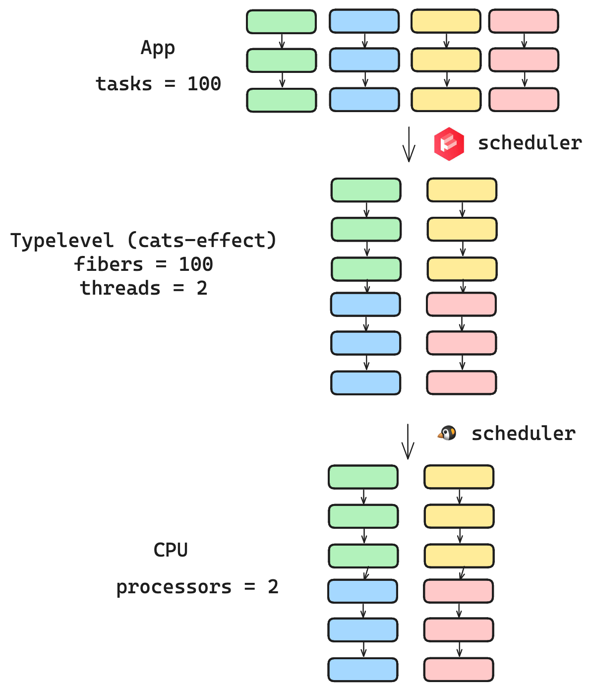

class: center, middle

# The Challenges of Concurrent Systems
## Zainab Ali
### https://zainab-ali.github.io/challenges-of-concurrent-systems

???
---
class: middle

# It's just a demo
 - A webservice
 - One endpoint
 - One user
???
Let's set the scene.

Imagine that you're a junior developer. You work in a small team, in a small company.

It's not doing so well. It doesn't have many customers.

One morning, your manager comes up to you and gives you a task. She says, I need you to design a webservice.

What sort? You ask.

It's a counting service. It just needs one endpoint, to update a counter. And it's only for demo purposes.

It's for our salesperson. He works on Fridays and he's showing off this new system.

That sounds fine. It's just a demo. In fact, it's the perfect task for you because you've never actually written a webservice from scratch before.

You code it quickly and things seem to go well. You get some feedback from the salesperson, and you add a few more features. 

Sometimes it has bugs, but that's ok. Each time you fix them, you take it down. It just needs to be up on Fridays, after all.

And then one day, it sells.

---
class: center, middle

# Sale!
???

Congratulations!, your manager says. We finally have a customer!

Your sales team is having a great day. The whole company seems to be celebrating. 

Except you. You're looking at the contract.

Your service now needs to support thousands of users. It needs to be running all the time, even when you roll out new versions.

So while everyone else is celebrating, you're inside scratching your head wondering how on earth you're going to achieve it.

---
class: center, middle

# Scaling is challenging
???


Scaling a system is hard. It's hard, but not because large scale systems are complex. They're necessarily simple. 

It's hard for you, simply because you haven't done it before. In fact, very few of us have experience scaling systems. And so when we design systems from scratch, we don't design them to be scaled. 

---

class: center, middle
# Concurrency is challenging
## But it doesn't have to be

???

The challenge of scale is the challenge of concurrency.

You don't always need to care about it.

If you're writing an admin script for yourself or your team, you definitely don't need to.

If you're writing a system for ten internal users, you do need to think about concurrency, but not too much.

But for a lot of systems, handling concurrency is vital. If not at the beginning, then at least when they're successful.

Concurrency is challenging, but it doesn't have to be.


---
class: middle

<div class="side-by-side" style="display: flex;justify-content: space-evenly;">
<div style="display: flex;flex-direction: column;align-items: center;">
<h2>Scala</h2>

</div>
<div style="display: flex;flex-direction: column;align-items: center;">
<h2>Typelevel</h2>

</div>
</div>

???
I'm Zainab, I'm a functional programmer and trainer, and in particular I train people to build concurrent systems.

I love lots of functional languages, but in particular Scala. Scala is a great language for concurrent systems. 

Does anyone here use it? I'm your community rep. I also organize the London Scala User Group, a local meetup. And I'm a Scala ambassador, which means if you're interested in learning more about Scala, please come ask.

I'm also passionate about open source. I contribute to and maintain concurrency related projects in the Typelevel ecosystem.

That said, you don't need to know anything about Scala or Typelevel, or even want to learn. You're not here to learn how to use this ecosystem, but what makes it's good.

---
class: middle

# Agenda
 - Reasoning
 - Systems beneath
 - Asynchronous programming
???

5 minutes

---
class: center, middle

# Reasoning

???

We're going to explore what concurrency is, and how you can think about it on paper.

---
class: middle

# Calling it once

```sh
/increase?inc=2
``` 

```sh
Count before is 1
Count after is 3
``` 

???

Consider a very simple service. It has a single endpoint that increments a counter.
Here is an example of calling the endpoint.

---
class: middle

# At the same time

```sh
/increase?inc=2
/increase?inc=4
```

```sh
Count before is 1
Count before is 1
Count after is 3
Count after is 5
``` 

???

We see the following behaviour when we call the endpoint twice. 

The count is initially one, and we want to increment it by two and four. But at the end, the count is five.

In fact, when we inspect the count later, we see that its value is three!

---
class: middle

```java
public class Service {
    private int count;

    public void increase(int inc) {
        int current = get();
        System.out.println("Count before is " + current);
        int next = current + inc;
        set(next);
        System.out.println("Count after is " + next);
    }

    private int get() {
        return count;
    }

    private void set(int next) {
        count = next;
    }
}
```

???

Here is the code for this service. The increment function gets the count, increments it. It prints out the value before and after.

This is a very simple bug, some of you may have spotted it already. The important thing here is not the bug, but the techniques we use to find it.

---

# Non-determinism


???


By saying these things are concurrent, I mean that they are independent. 

Let's take a look at a non-concurrent relationship. The green get must happen before the green set.
The blue get must happen before the blue set.

But the green get and blue get can happen in any order. When our service runs, a single sequence of tasks is run, but it might not be the one we expect. . 

This property is known as non-determinism, and it's the source of all concurrency bugs.

This non-determinism makes things difficult to reason about.

In order to predict all possible outcomes, I need to take each of these steps and interleave them in all possible orders, and figure out the result. This can only be done on paper - it's not possible to test for. 

In this case, there are four outcomes. You can imagine how hard this is when there are more.

There are two basic techniques for helping us: identifying shared mutable data, and identifying side-effects.

---
class: middle

# Shared mutable data

```java
private int count;
```

???

When you think about your code, split it into data and functions. Then look at the data that changes. And try and find the bits that are shared between these sequences of tasks. 

In our case, we have a couple of bits of data. We have a string, and the count.

The only thing that's shared is this count.

We refer to things that are changing as mutable.

---
class: middle

# Avoiding shared mutable data
- Rust: `mut` for explicit mutability
- Scala: `val`, `case class` explicit immutability.
- Erlang: can't share mutable data
???

Shared state is the source of all problems. In fact, a lot of languages prevent you from doing it.

We'll look at how to deal with shared state in a minute. First, there's one more thing we need to identify.

---
class: middle

# I/O operations

```java
queryDatabase()
```

```java
readFile()
```

```java
println("Hello")
```

???

And those are identifying IO operations.

---
class: middle

# Side effects
 - mutating data
 - I/O operations
 
# Pure
```java
3 + 4
```
---

```java
int current = get();                              // get
System.out.println("Count before is " + current); // printBefore
int next = current + inc;                         // calcNext
set(next);                                        // set
System.out.println("Count after is " + next);     // printAfter
```

---
class: center, middle


???

---
class: center, middle


???

---


???

If we do this, we can spot the sequence
We've made an assumption that is incorrect.
We've assumed that get and set must be performed together, without anything else touching the count.
This property is known as atomicity. 

Managing shared state in Java can be complex. But you probably shouldn't be doing it in the first place. Your shared state should live in a datastore, not in your service.

Actually, get and set become IO operations, and we'd want to execute it in a single operation.

---
class: middle

# Tips for reasoning
 - Avoid shared mutable data
 - Identify side effects

---
class: center, middle

# Functional programming

???

25 minutes

If you structure your code to reason about concurrency, you end up writing something very similar to functional programming.
Scala is a great language for doing this.
---
class: center, middle

# Systems beneath

---
class: center, middle


???
Concurrency is about doing multiple things "at the same time", where "at the same time" means in any order.

But realistically, there's a limit to the number of things our computers can do and that's governed by their physical processors. I'm making lots of simplifications here. But say I have two cores, I can only run two things at once. How do I achieve running a hundred?

There are layers of technologies between my app and the instructions on the processor. Something in those layers needs to take my 100 tasks, interleave them, and map their portions onto the two processors. We call this thing a scheduler.

Whenever we have M tasks we want to map onto N things, we have a scheduler. And what's known as M:N threading.

It's entirely up to the scheduler how it does the mapping. It could choose to split each of the tasks up into 100 and execute a piece of each, or execute one then another then another.


---
class: center, middle


???

The ideal scheduler would try not to split the sequences up too much. That's because of a lot of shared context between tasks in a single sequence.

---
class: center, middle

# Before Java 21


???
Let's say you had an application using just Java and no libraries. And you're not on Java 21 yet.

The only scheduler you could use was the OS scheduler.

---
class: center, middle


???

You give a sequence of tasks to the OS scheduler by creating what's called a thread.

And the OS scheduler arranges those tasks on the processor.

The Linux scheduler is built for fairness. 

As a result of the nature of Java applications, it tends to split threads up much more than it needs to.

This is a huge oversimplification, I'd love to talk to you more about why it does this. The important thing to take away is not that the OS scheduler is bad, it's really good, but just that it's not suited to webservers.

---
class: center, middle

# After Java 21


???

If you don't know what scheduler you're using, it's probably the OS one. Thankfully, Java 21 comes with its own scheduler. You use it by enabling virtual threads.

---
class: center, middle


???
The JVM scheduler maps your tasks, which you put on virtual threads, down to OS threads, and gives those OS threads to the Linux kernel.

---

class: center, middle

# Async frameworks


???

Of course, you could build really scalable, concurrent applications before Java 21. You just needed to use some libraries.

If you used Scala and the Typelevel stack, you could make use of the Typelevel scheduler.

---
class: center, middle



???

This does the same thing as the JVM's virtual threads. The scheduler, which is part of the cats-effect library, maps your tasks down to platform threads. 

---
class: center, middle


???

When we think about the stack of technologies, we should remember that they're not built by machines. There are people maintaining them, and they change. One of the benefits of using a library for a specialized use case is that it can adapt quickly, as long as it has a healthy set of maintainers and contributors.

We'll talk a little bit more about how this ties into concurrency in a second.

---
class: middle

# Systems beneath

 - Don't use the OS scheduler
 - Virtual threads use a scheduler
 - Typelevel has an excellent one

???

35 minutes

---
class: middle, center

# Async programming

???

We've talked about how to reason about concurrency, and basic performance.

But we need more than that if we want to write robust applications. And that's because when we program concurrently, we have a totally different control flow. And so different mechanism for building code.

---
class: middle, center

# Composition


???

Something that we care a lot about in the functional programming space is a property known as composition.

Composition is the ability to build a program from smaller blocks.

As a concrete example, let's say I have a different webserver that calls my increase endpoint and at the same time performs some database query. If my database is a bit flaky, I might want to retry that operation. And since I'm doing this as part of a http request, I want this to timeout after 30 seconds.

I want to compose this program from many smaller blocks.

---
class: middle, center

# Sequencing

<div>

</div>
---
class: middle

# Sequencing

```scala
for {
 _ <- task
 _ <- task
} yield ()
```
---
class: center, middle

# Join


---
class: middle

# Join

```scala
(task, task).parTupled
```
 
---
class: middle
# Retry

```java
private CompletableFuture<int> retry(CompletableFuture<int> fut) {
    return ...
}
```

---

class: middle

# IO

```scala
def retry(task: IO[Int]): IO[Int] = 
  task.handleErrorWith(_ => task)
```

---

# Composition


```scala
(retry(task), inc)
  .parTupled
  .timeout(30.seconds)
```

---
class: center, middle

# Tasks as programs

| Task  | Composable |
|-------|
| Java Future | No |
| Virtual threads | No |
| Scala Future | No |
| cats-effect IO | Yes |
| Rust Future | Yes |

---
class: middle
# Rich ecosystem
---
class: middle
# Recipe
 - Reasoning on paper
  - no shared state
  - identify side effects
  - functional programming
 - Tower of tech
  - Schedulers
 - Composable model
  - Rich ecosystem
  - Easy to maintain
  - Easy to reason
---
class: center, middle

# You can build concurrent systems

???

45 minutes

---
class: middle
# Learn more
 - [cats-effect](https://typelevel.org/cats-effect/)
# Watch at home
 - [The case for Effect Systems, Daniel Spiewak](https://www.youtube.com/watch?v=qgfCmQ-2tW0)
 - [Threads at Scale, Daniel Spiewak](https://www.youtube.com/watch?v=PLApcas04V0)
 - [7 deadly sins of concurrent programming, Sarah Zebian & Taoufik Benayad](https://www.youtube.com/watch?v=-E4q1CZg-Jw)
 
???
---
class: middle
# Later at Devoxx
 - What's looming in Spring?
 - Six things we learned implementing Rockstar on Quarkus
 
---
class: middle

# Find me
 - Newsletter: [buttondown.email/zainab](https://buttondown.email/zainab)
 - Email: zainab@duskimpression.com
 - LinkedIn: [zainab-ali-fp](https://uk.linkedin.com/in/zainab-ali-fp)
 - GitHub: zainab-ali
 - Discord: Scala
 - London Scala User Group: [meetup.com/london-scala](https://www.meetup.com/london-scala/)

---
class: center, middle
# Thank you!
## Questions?
### https://zainab-ali.github.io/challenges-of-concurrent-systems
